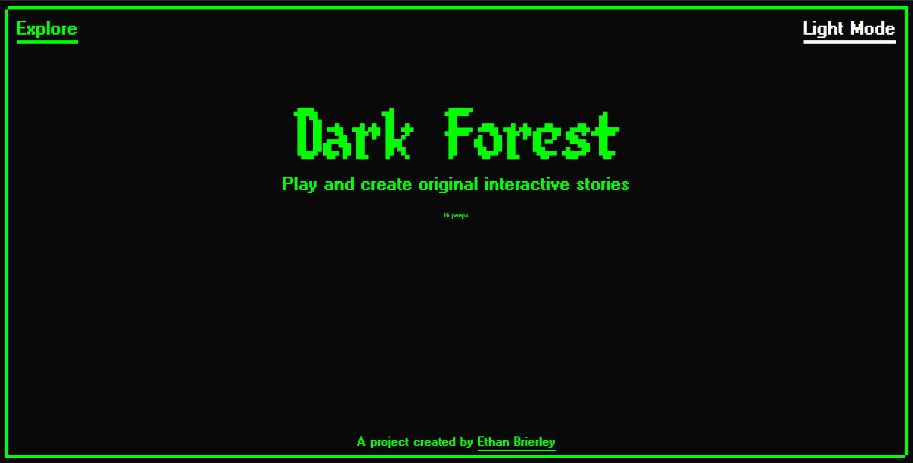

# dark-forest-nea

A full-stack Rust Wasm project I made for an assignment while studying A-Levels.

## Required tools

- [Rust](https://www.rust-lang.org)
- [cargo-make](https://sagiegurari.github.io/cargo-make/)

## Commands

- `cargo make run`
- `cargo make run_watch`
- `cargo make run_release`
- `cargo make build`
- `cargo make build_watch`
- `cargo make build_release`
- `cargo make check`
- `cargo make check_watch`
- `cargo make verify` Runs Tests, Clippy and rustfmt with `--check`
- `cargo make fmt`
- `cargo make doc`
- `cargo make doc_open`
- `cargo make doc_watch`
- `cargo make coverage` Note: coverage does not work on WASM files such as client
- `cargo make coverage_open`

TODO Cleanup makefiles.